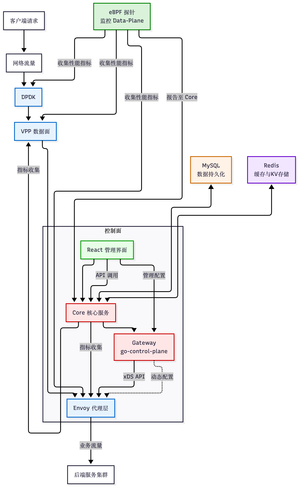

# quebec

> 高性能网关系统
>
> 本项目实现了一个高性能的网络网关解决方案，结合了DPDK、VPP、Envoy等前沿技术，以支持高吞吐量和低延迟的数据处理需求。通过引入eBPF探针监控整个数据面，并使用MySQL进行持久化存储，Redis作为缓存层，实现了高效的数据管理和快速响应。此外，前端管理界面采用React构建，提供了直观的操作面板。 
## 架构图 

## 技术栈 
- `DPDK`: 数据平面开发套件，用于高速网络包处理。 
- `VPP`: 思科开源的向量数据包处理框架，建立在DPDK之上。 
- `Envoy`: 服务代理，提供L7层协议处理能力。
- `Gateway`: Envoy控制平面实现，负责动态配置分发。 
- `Core`: 用户管理、展示与存储等其他核心服务。
- `MySQL`: 关系型数据库，用于数据持久化。 
- `Redis`: 内存中的键值存储，用作缓存和KV中间件。 
- `eBPF`: 扩展Berkeley Packet Filter，用于内核态程序执行和监控。 
- `React`: 前端库，用于构建用户友好的管理界面。 
## 组件交互 
1. 客户端请求经过网络到达DPDK，由其处理并转发至VPP。 
2. VPP对数据包进行进一步处理后传递给Envoy，Envoy根据配置完成L7层处理。 
3. eBPF探针实时监控数据面各组件的性能，收集指标反馈给核心服务(Core)。 
4. 核心服务(Core)与MySQL及Redis交互，提供业务逻辑处理，并通过API与前端(React)通信。 
5. 控制面(Gateway/go-control-plane)负责Envoy的动态配置更新。